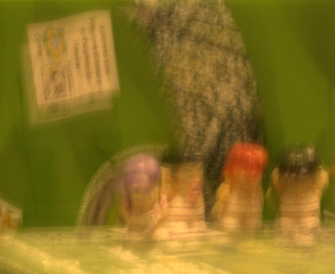
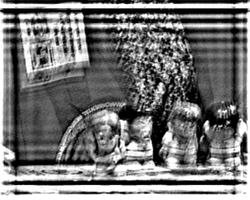

# deblur

<!-- README refined by Cursor -->

Two-Phase Kernel Estimation for Robust Motion Deblurring

## Overview

This repository contains Python code from an older research, course, or prototype project. The README has been refreshed to make the repository easier to scan while preserving the original notes below.

## Repository Contents

- Top-level source files and project assets.

## Setup

- This legacy repo does not pin a full environment. Start from the language/toolchain implied by the source files, then install missing packages as reported by the runtime.

## Usage

- `python main.py`

## Data and Artifacts

No new large artifact is stored in this repository. If a dataset or checkpoint is required, follow the links and notes in the original section below.

## Status

This is a `Batch B` cleanup pass for a legacy repository. Commands may require dependency/version adjustments on a modern machine.

## License

No explicit license file was found in this checkout; check the original project context before reusing code.

## Original Notes

# Two-Phase Kernel Estimation for Robust Motion Deblurring
## This is an unofficial python implementation of the deblurring algorithm, currently, the first phase is finished.

# Results
Original Image

Latent Image

# problems
- There are some ringing and bordering effects in the estimated latent image. It is not clear how the author handles this.
- In the inverse FFT for solving kernel, kernel values are not always positive (not even real) and kernel values do not sum to 1. How does the author handle this? Currently, I simply project the kernel into the valid solution manifold. Maybe a better solution is to introduce a Lagrange multiplier.
