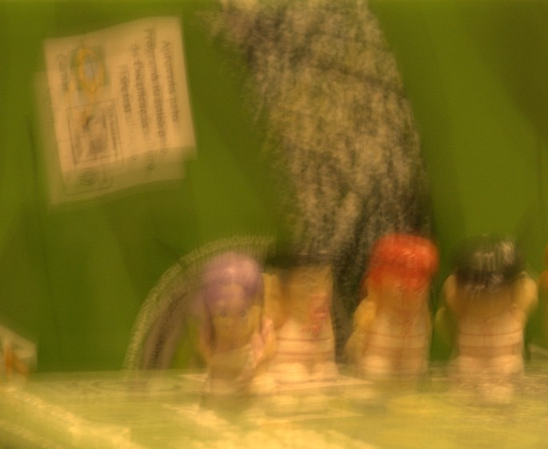

# Two-Phase Kernel Estimation for Robust Motion Deblurring
## This is an unofficial python implementation of the deblurring algorithm, currently, the first phase is finished.

# Results
Original Image

Latent Image

# problems
- There are some ringing and bordering effects in the estimated latent image. It is not clear how the author handles this.
- In the inverse FFT for solving kernel, kernel values are not always positive (not even real) and kernel values do not sum to 1. How does the author handle this? Currently, I simply project the kernel into the valid solution manifold. Maybe a better solution is to introduce a langrange multiplier.